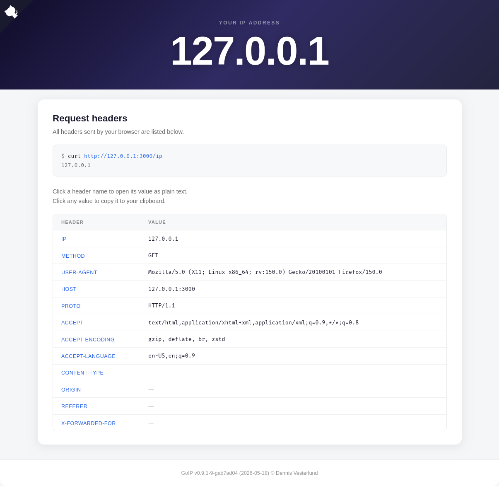

# goip

Small site that displays connecting client info (IP, User-Agent, Host, etc.)

## Usage

```
make         # build binary
make run     # build and run the server
make test    # run tests
```

## Example



## Author

Dennis Vesterlund \<dennis@vestern.se\>
